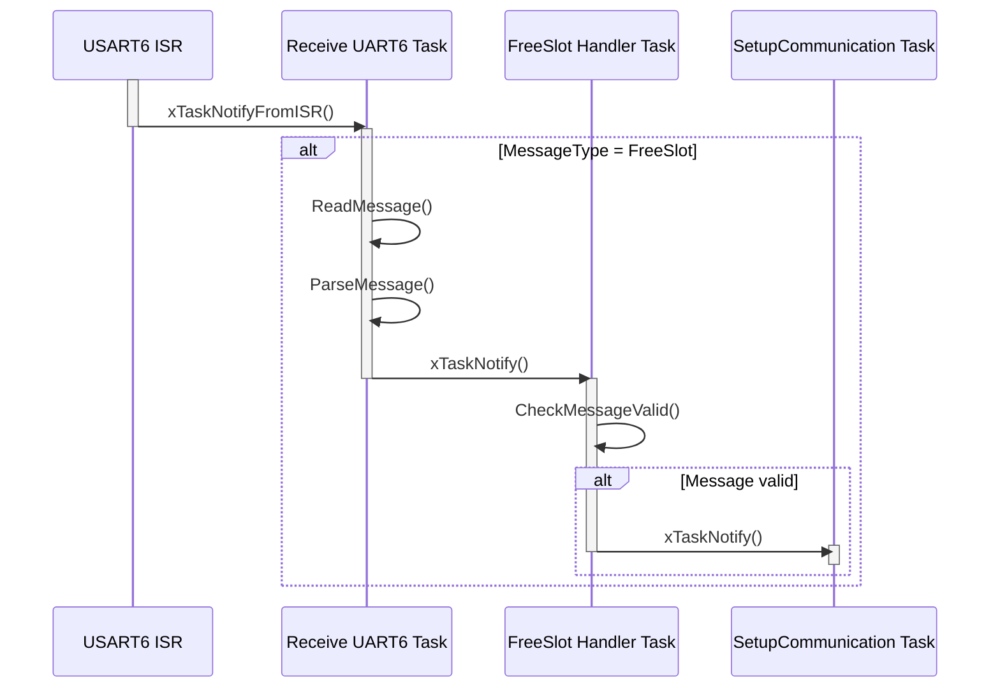
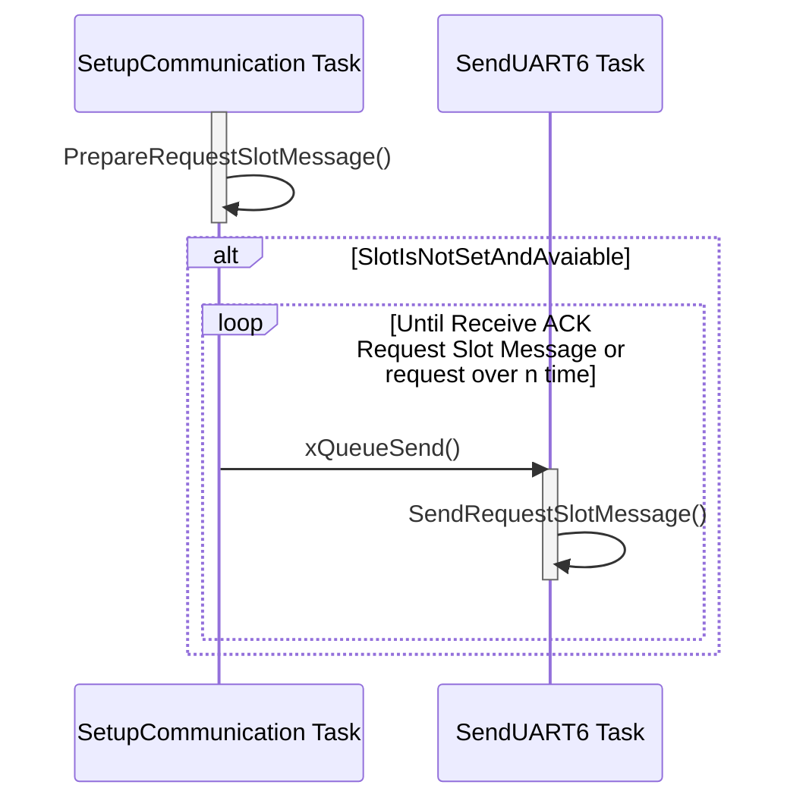
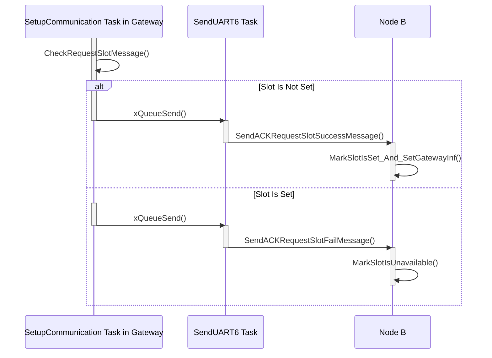
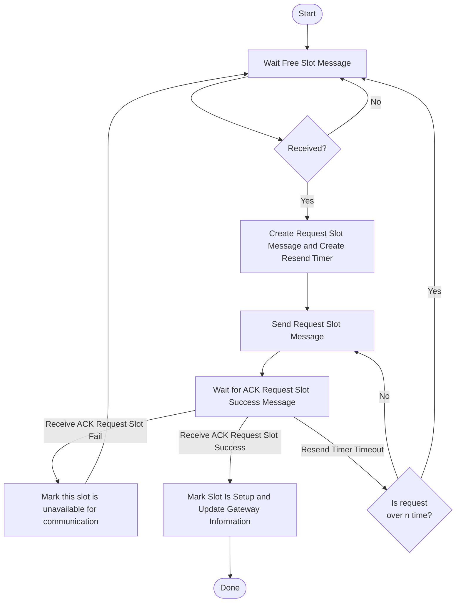

# **Sequence Diagram for Setup communication between Node with Gateway:**

###  1. Sequence Diagram for Receive Free Slot Message:

#### This Sequence Diagram is same when receive Request Slot Message, ACK Request Success Message, ACK Reuqest Fail Message, Update HEAT Value Message.

### 2. Sequence Diagram for Send Request Slot Message:

### 3. Sequence Diagram for Handle Request Slot Message in Gateway and Receive ACK in Node B:

### Flowchart: Setup Communication Between Node and Gateway

