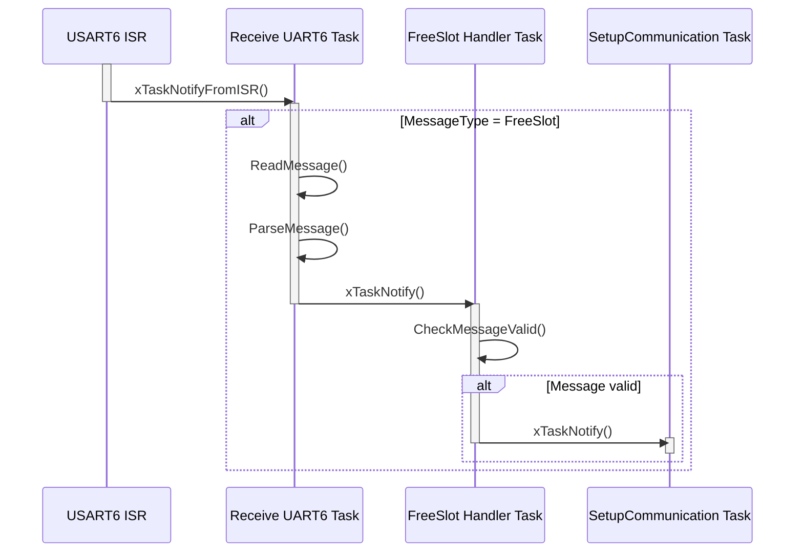
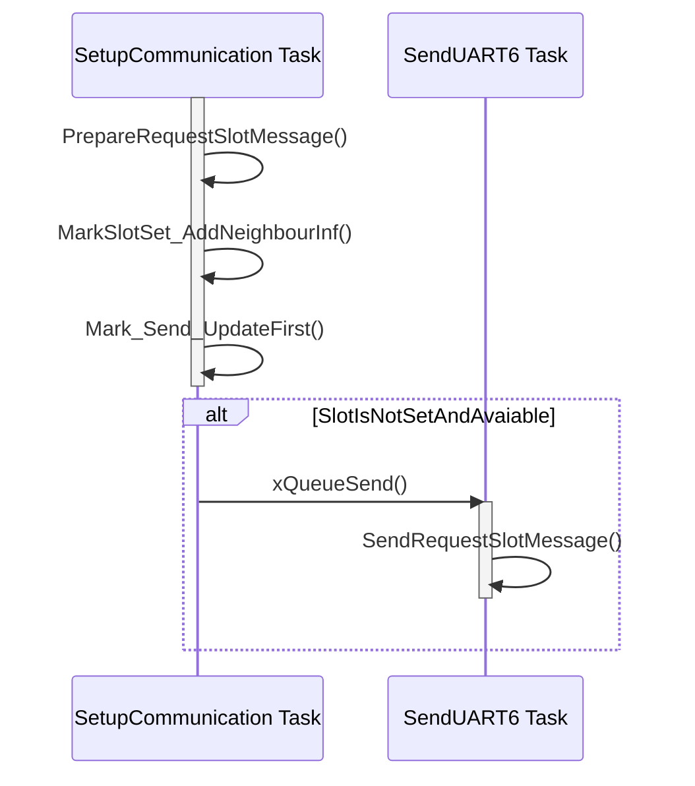
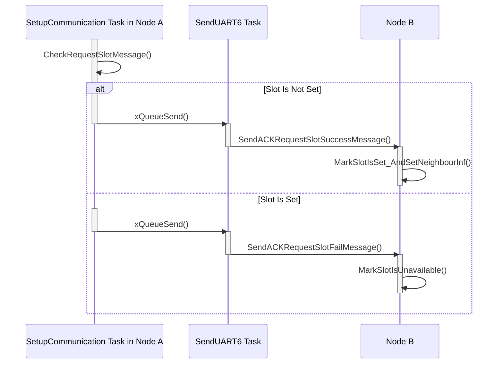

# **Sequence Diagram for Setup communication between Node A and Node B or Node with Gateway:**

###  1. Sequence Diagram for Receive Free Slot Message:

#### This Sequence Diagram is same when receive Request Slot Message, ACK Request Success Message, ACK Reuqest Fail Message, Update HEAT Value Message.

### 2. Sequence Diagram for Send Request Slot Message:

### 3. Sequence Diagram for Handle Request Slot Message in Node A and Receive ACK in Node B:

### 4. After Setup Communication for the 1st time:
#### After Setup communication with other Node/Gateway for the first time, the slot that has been set is slot 0 and in other slots of 1st cycle Node will listen to any other message(FreeSlot/Update Heat Value) to check if this slot is available to send Free Slot message in next cycle:

<table border="1" cellspacing="0" cellpadding="5" style="text-align:center;">
  <tr>
    <th>Slot 0</th>
    <th>Slot 1</th>
    <th>Slot 2</th>
    <th>Slot 3</th>
    <th>Slot 4</th>
    <th>Slot 5</th>
  </tr>
  <tr>
    <th>Set</th>
    <th>Check</th>
    <th>Check</th>
    <th>Check</th>
    <th>Check</th>
    <th>Check</th>
  </tr>
</table>

#### nháp:
<table border="1" cellspacing="0" cellpadding="5" style="text-align:center;">
  <tr>
    <th>Slot 0 (G - S)</th>
    <th>Slot 1 (G - S)</th>
    <th>Slot 2 (G - S)</th>
    <th>Slot 3 (G)</th>
    <th>Slot 4 (G)</th>
    <th>Slot 5 (G)</th>
    <th>Slot 0 (G - U)</th>
    <th>Slot 1 (G - S)</th>
  </tr>
  <tr>
    <th>Slot 0(A - R)</th>
    <th>Slot 1(A - X)</th>
    <th>Slot 2(A - X)</th>
    <th>Slot 3(A - S)</th>
    <th>Slot 4(A - S)</th>
    <th>Slot 5(A - S)</th>
    <th>Slot 0(A - U)</th>
    <th>Slot 1(A)</th>
  </tr>
    <tr>
    <th> </th>
    <th> </th>
    <th>Slot 0(B - RG)</th>
    <th>Slot 1(B - RA)</th>
    <th>Slot 2(B)</th>
    <th>Slot 3(B)</th>
    <th>Slot 4(B - X)</th>
    <th>Slot 5(B - X)</th>
  </tr>
</table>

- If Slot Register (A for example) = Slot 0 of Gateway/Other Node, in second-half of cycle, A will send Free Slot Message.
- If Not, Node (B for example) will hear till end of cycle.