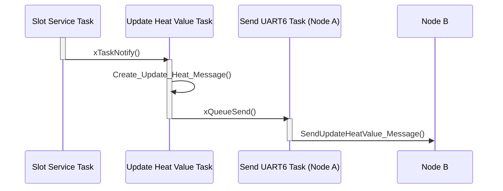
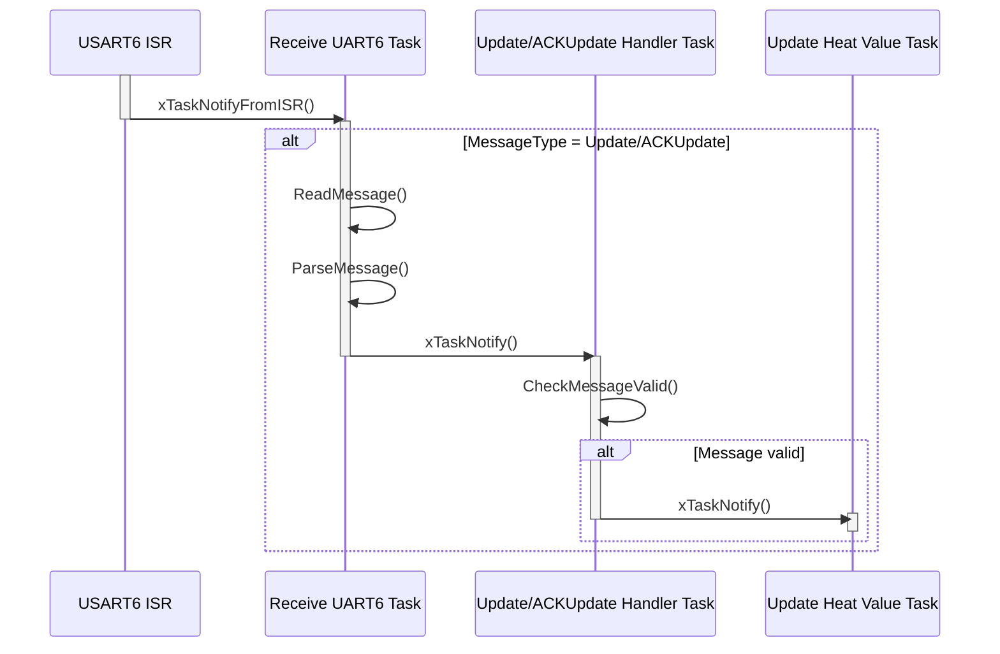
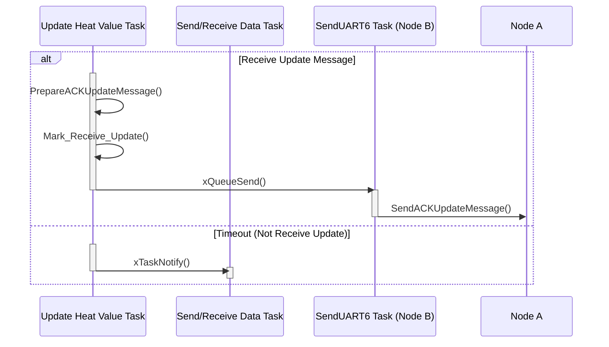
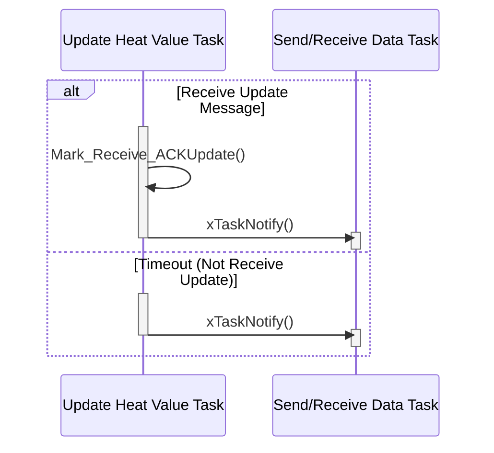
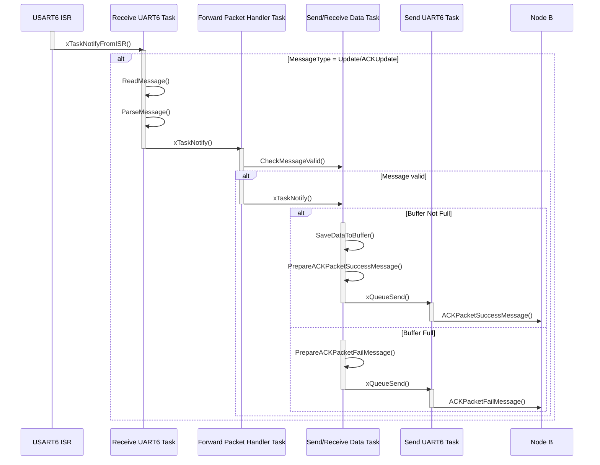
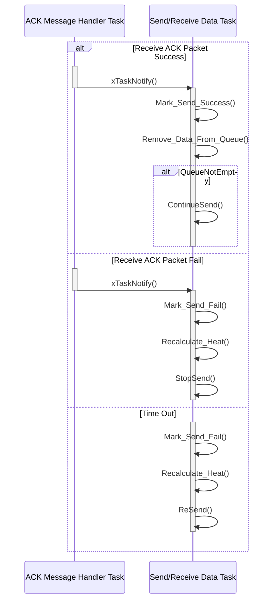
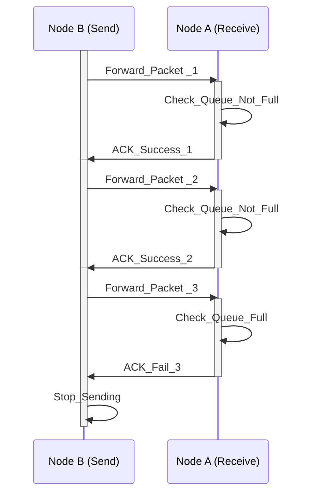
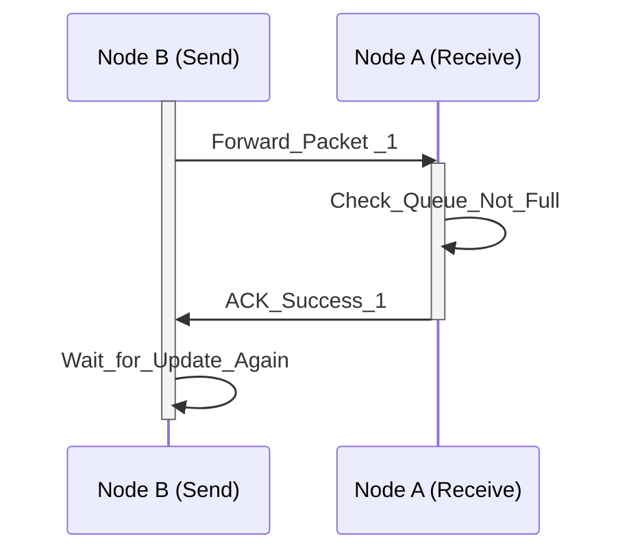

# **Sequence Diagram for Update Heat Value and Send/Receive Data Packet:**

###  1. Sequence Diagram for Update Heat Value (At the begin of slot that has been set):
####    *Assume that Node A send Update and Node B receive.*

### 2. Sequence Diagram for Receive Update/ACKUpdate Heat Value:

### 3. Sequence Diagram for Handle Update Heat Value Message:

### 4. Sequence Diagram for Handle ACK Update Message:

### 5. Seuquence Diagram for Receive Data (Data from Node B):

### 6. Seuquence Diagram for Receive ACKPacket (after ACK (Fail/Success) Message Handler Task receive xTaskNotify() From ACK Receive UART6 Task or not receive any ACKPacket):

### 7. Send Data Process After Update Success (in 1 slot):

### 7. Send Data Process After Update Fail:

### 8. other Information:
- Who send update first is the one receive Data.
- Heat Value (Percentage to Gateway) calculate by using number of success sent data / number of data have been sent.
- Forwarding Time = the time from the slot receiving data from the source to the slot forwarding this data to another node or gateway.

For example:
<table border="1" cellspacing="0" cellpadding="5" style="text-align:center;">
  <tr>
    <th>Slot 5</th>
    <th>Slot 0</th>
    <th>Slot 1</th>
    <th>Slot 2</th>
    <th>Slot 3</th>
    <th>Slot 4</th>
  </tr>
  <tr>
    <th>Receive Here</th>
    <th>Check</th>
    <th>Check</th>
    <th>Check</th>
    <th>Forward Here</th>
    <th>Check</th>
  </tr>
<table>