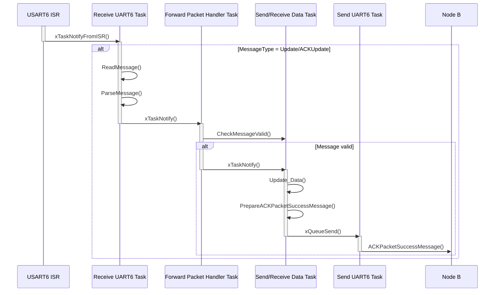
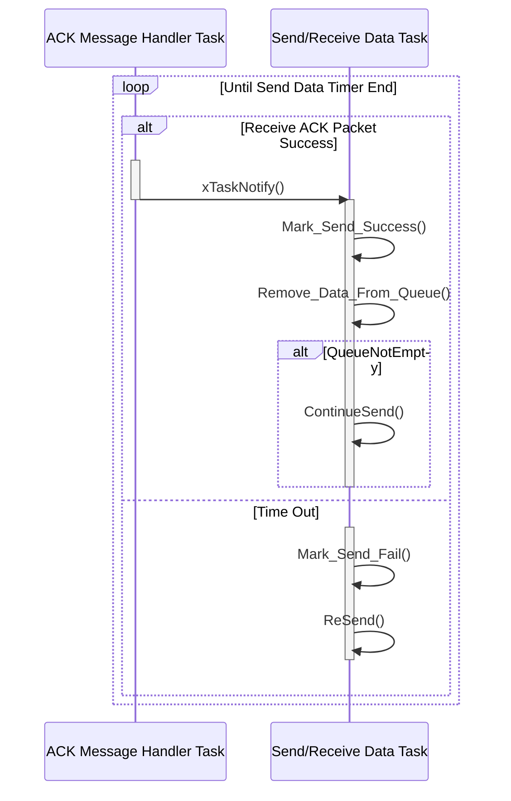
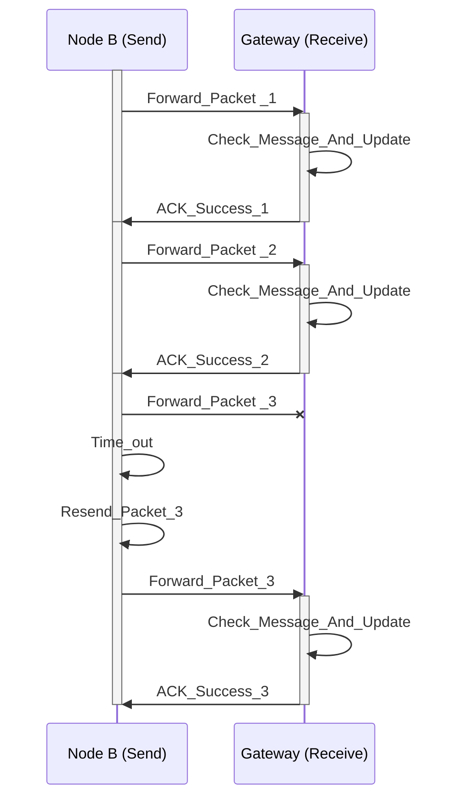
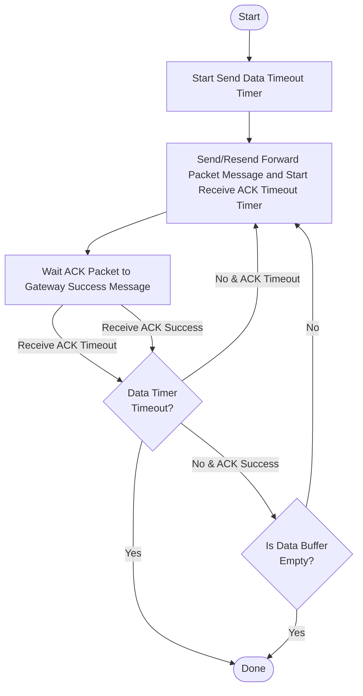

### 1. Seuquence Diagram for Receive Data in Gateway (Data from Node B):

### 2. Seuquence Diagram for Receive ACK Success Message Handler Task receive xTaskNotify() From ACK Receive UART6 Task or not receive any ACK Success:

### 3. Send Data Process After Update Success (in 1 slot):

### 4. Flowchart: Send And Receive Data Between Node and Gateway
